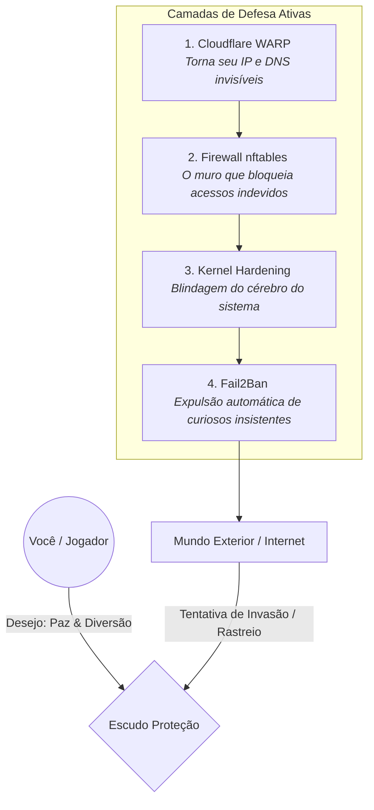

# 🛡️ Proteção Completa — CachyOS (Gaming Safe)

### Sinta-se em casa, sinta-se seguro.🎮

O **Proteção** não é apenas um script de segurança. É o seu **escudo digital invisível**, projetado para que você possa focar no que realmente importa: **sua diversão e produtividade**, sem preocupações com invasores ou exposição de dados.

Desenvolvido especialmente para a comunidade **CachyOS**, ele blinda seu sistema com camadas de elite, mantendo 100% de compatibilidade com todos os seus jogos (Steam, Epic, BattlEye, EAC).

---

## 🗺️ Seu Mapa de Proteção (Como Funciona?)

Visualizamos a segurança como um castelo. Antes de qualquer ameaça tocar seus arquivos ou seus jogos, ela precisa passar por quatro guardiões incansáveis:



---

## 🌟 Por que usar o Proteção?

Em um mundo digital cada vez mais exposto, o simples ato de jogar pode revelar seu IP e localização para estranhos. Veja como nós resolvemos isso:

| O Medo | Nossa Proteção | Benefício Real |
|:--- |:--- |:--- |
| **Exposição de IP** | Cloudflare WARP | Ninguém sabe de onde você está conectado. |
| **Ataque de Invasão** | nftables Firewall | Invasores batem na porta e não recebem resposta. |
| **Falhas de Sistema** | Kernel Hardening | Blindagem de memória contra malwares modernos. |
| **Brute Force** | Fail2Ban | Quem tentar adivinhar sua senha é expulso na hora. |

---

## 🎨 Uma Experiência Premium (GUI v2.0.0)

Acreditamos que segurança também deve ser bonita. Nossa interface gráfica foi desenhada conforme o padrão **UI/UX Pro Max**:
- **Design de Vidro (Glassmorphism):** Uma interface translúcida e moderna que respira com o sistema.
- **Deep Space Dark:** Tons escuros profundos que protegem seus olhos durante as jogatinas noturnas.
- **Acompanhamento Real:** Veja cada passo da instalação em tempo real com animações fluidas.

---

## 🚀 Comece em Segundos

Copie e cole a linha abaixo no seu terminal para baixar, preparar e abrir o seu escudo instantaneamente:

```bash
git clone https://github.com/Higherever/Prote-o.git && cd Prote-o && bash iniciar.sh
```

> **Dica de mestre**: Em utilizações futuras, basta entrar na pasta `Prote-o` e redigitar `bash iniciar.sh` para que a interface se abra como mágica, sem precisar realizar instalações recorrentes.

---

## 📊 Transparência Total (Logs)

Você está sempre no controle. Tudo o que o sistema faz fica registrado para sua conferência:
- `logs/logFront/`: Histórico do que você vê na tela (Últimos 10).
- `logs/logBack/`: Cada detalhe técnico do que foi instalado ou configurado.

---
*Criado com ❤️ por gamers, para gamers. Sinta-se seguro, jogue com alma.* 🛡️🎮
